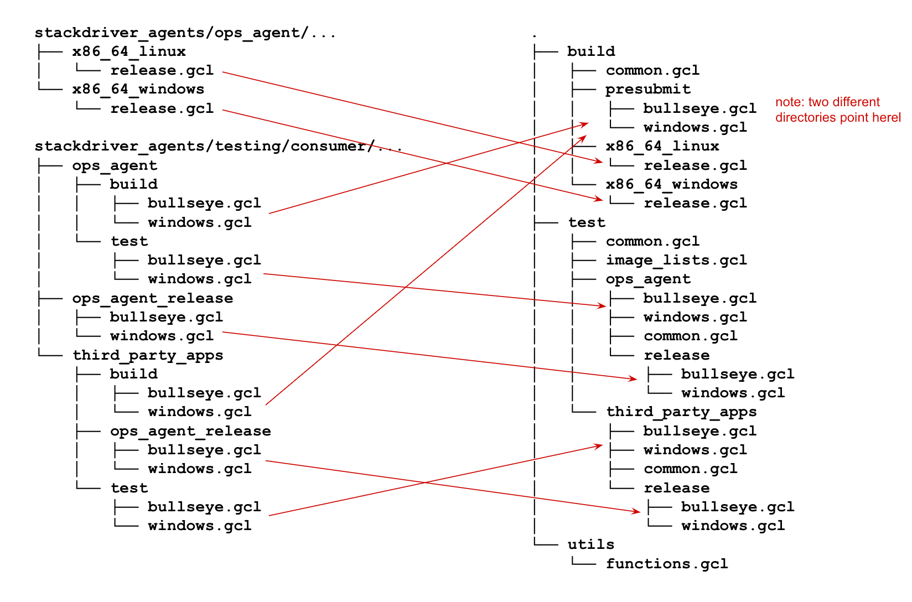

# Kokoro Infrastructure

This directory contains configs and scripts that are executed by Kokoro. The
configs are written in a quirky language called GCL, which stands for "General
Configuration Language". Each file `foo.gcl` corresponds to a single Kokoro
build that gets launched on each PR to run integration tests. They share
common config fields by inheriting from a hierarchy of `common.gcl` files.
After being run through the GCL interpreter, each `foo.gcl` is resolved into a
protocol buffer that determines what that particular build will do. The most
important field is `build_file`, which determines which script to run. The
build configs also specify extra environment variables to pass to the script as
it runs. There are other fields as well, such as `define_artifacts`, but they
are less important.

This is only half of the story, however. Half of our Kokoro configs live inside
Google's code silo, called Piper. They configure what kind of builds we want to
have, what their names are, and what source code they can see. Here is a
diagram that shows how these configs (called "job configs") are structured and
how they point to the configs here (called "build configs"). Only bullseye and
Windows are pictured, for brevity.

The original drawing for this diagram is [here](https://docs.google.com/drawings/d/1C4G8SfwmB0AcYrPIN0ipt8xMQDo79lBw8GwaR57NZzU/edit?usp=sharing&resourcekey=0-9tzXVXtyXWxgUiFCJdcMdA).

Builds with "release" in their name are executed when building release builds
of the Ops Agent. All other builds are attached to GitHub and run as presubmits
on every PR.

Adding a new distro to our test matrix requires adding both a new build config
here and adding a new job config to Piper that points to the build config. We
would also need to modify the job configs for the fanout jobs `all_distros`
that point to the so-called sub jobs for each distro.

Restructuring this directory is a bit tricky because it involves changes
spanning GitHub and Piper. To perform such a restructuring, copy the build
configs to their new locations, then change the job configs to point to the new
build configs, then delete the old build configs.